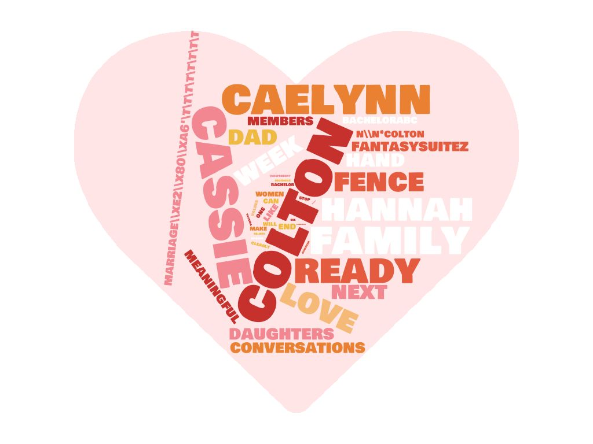

# Mini Project 3
Base repository for Mini Project 3:Text Mining

Need to create file (config.py) to store API information.

Images created online based on most frequent words for each collection of data
  
  
  

Full Write-up and Reflection at (https://github.com/sd19spring/TextMining-KristinAoki/blob/master/writeupandreflection.ipynb)
