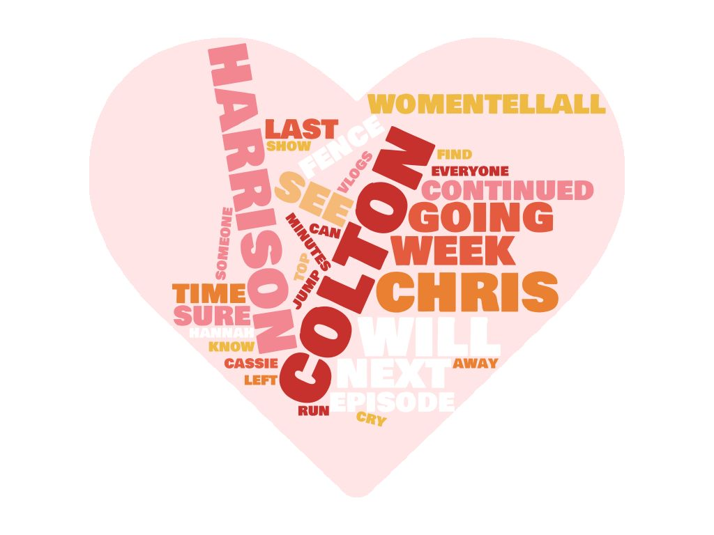

# Mini Project 3
Base repository for Mini Project 3:Text Mining
  This project scraps Twitter for tweets relating to The Bachelor. There are functions to gather tweets from hashtags and timelines.
  From the tweets gathered the code runs a word frequency function to determine the top n words in the given set of tweets.

Need to create file (config.py) to store API information.

Images created online based on most frequent words for each collection of data
  
  
  

Full Write-up and Reflection at (https://github.com/sd19spring/TextMining-KristinAoki/blob/master/writeupandreflection.ipynb)
